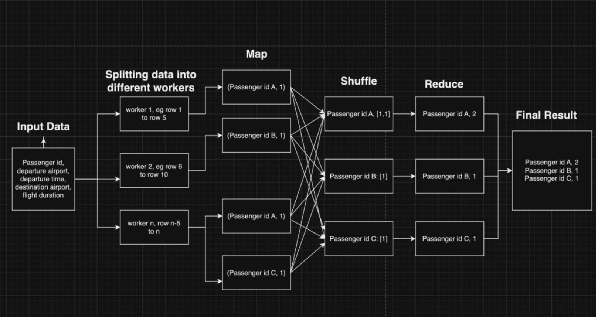

# High level description
A MapReduce solution pattern (map, shuffle, and reduce) was used to identify the passenger(s) with the highest number of flights based on available data. Data is not distributed for parallel processing or explicit splitting is not done. However, multi thread processing was used to distribute work across multiple CPUs using a pool of worker processes. Each worker process independently processes a portion of the input data mimicking distributed systems. Workers apply map function to each row of the flight data in parallel resulting in key-value pairs of assenger id and 1. The workers than call shuffle function to group together values with the same keys or passenger ids in parallel. Finally, reduce method is called to sum over all the values of a key to find the total number of flights per passenger. The passenger(s) with the highest hours is then searched over this summed list.


# MapReduce Functions implemented.

Figure 1 MapReduce Implementation logic overview.

Figure 1 shows the logic implemented to find the passenger(s) with highest number of flights.
Following is the flow of code and descriptions of the functions involved:

## Input Data
The input data is supplied in Comma Separated Value (CSV) format. There are six columns in the data, with passenger id being the first column. Each row represents the passenger travelling once. The entire data in CSV is converted to a list before distributing data to workers to pick.
Typically, in a MapReduce solution there is a master node or process called the job tracker which orchestrates data splitting. The main function in the implementation thus divides rows into a pool of workers.

## Splitting data:
Data is not explicitly split but divided among workers running in parallel across multiple CPUs. Each worker is independent and does not communicate or interfere with another. This behaviour mimics real world distributed systems where data are not in a singular machine. The split is performed by the master thread. The code utilises Python’s multiprocessing package to distribute rows into pools of workers where the number of processes is equal to the CPU count in the machine.

## Map function:
The map function is required to be able to do same computation across all the data at the same time. Thus, the Map function designed takes in any one row as argument. It then compares if the supplied row is valid with six columns. If valid it returns a tuple with the first element (key) as the passenger id while the second element as 1 (value). 1 was used as this is the start of a count. Map function is invoked by each worker for each row and then the result is accumulated as a large list of (key, value) tuples, whose length is equal to the number of rows in data. Map function is invoked by workers, thus runs in slave thread or task trackers. The function helps to discard unwanted information and initialize only the information of concern for the final output in an efficient way. From the list of rows only passenger id column was retrieved as key.

## Shuffle function:
Once every worker has finished initialisation of passenger ids as key and 1 as values, shuffle function groups together the list of tuples (by passenger id) received as an output from map function. The function takes list of tuples after Map function has been executed as input, builds a new dictionary with key as the first element of the tupl (passenger id) and appends values as list to the respective key. Thus, resulting data to be in the format {passenger id: [1,1,1]}. This process involves communication between the worker nodes to re-organise data.

## Reduce function:
Once the shuffling of data is finished the dictionary is passed into the reducer function, which runs on the reducer nodes where a user defined reducing operation takes place for the values. Each reducer receives a part of the key-value pairs from the shuffle state which is then accumulated as final output. The reducer function designed takes in the dictionary made in shuffle state as input and then outputs the sum of values (the list of ones). Since, we initialised with 1 for every passenger id instance in the mapping state, and then grouped together the data with passenger ids we got a list of ones which in total equals the number of flights taken. Since, the reducer function returns a list of every passenger’s total flight counts. To find the passenger(s) with the highest number of flights maximum value with total flight count as key was searched, and all the passenger ids with the maximum count was returned.

# Alternative Golang approach
An alternative code with Golang a much faster and a champion in concurrency was also used to implement the given solution. The code is uploaded in the repository as assign_golang.go. To run this one needs to download Golang from its website, and then run 

```go run assign_golang.go```

in its root directory.
